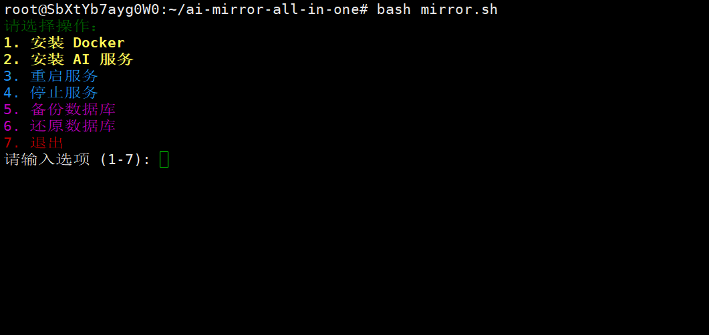

# ai-mirror-all-in-one
## 说明
**ai-mirror-allinone** 是集成了  gpt,克劳德,grok 三种镜像为一体的缝合怪，
三个镜像可以共享 mysql 和 redis镜像,减少了内存占用，还提供了bash脚本方便统一管理
三个仓库原版地址:
- https://github.com/xyhelper/chatgpt-share-server-deploy
- https://github.com/dddd-dddd-dddd/dddd-deploy
- https://github.com/lyy0709/grok-share-server-deploy
## 特别感谢
感谢**栋哥**和**傻傻大佬**在gpt,克劳德,grok 镜像上面的奉献

## 功能清单
    - 安装docker
    - 安装ai镜像(可选)
    - 备份数据库
    - 还原数据库
## 快速安装脚本

```
curl -sSfL https://raw.githubusercontent.com/xiaomifengD/ai-mirror-all-in-one/refs/heads/main/quick_install.sh | bash
```


后续可以用
```
bash mirror.sh
```
维护项目

grok 后台地址
http://域名/lyy0709

默认账号: admin 123456


---
claude 后台地址
http://域名/lyy0709

默认账号: admin 123456

---
gpt 后台地址
http://域名/xyhelper

默认账号: admin 123456