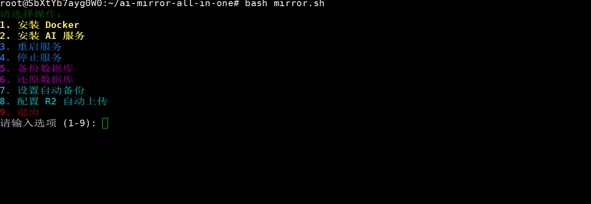

# ai-mirror-all-in-one
## 说明
**ai-mirror-allinone** 是集成了  gpt,克劳德,grok 三种镜像为一体的缝合怪，
三个镜像可以共享 mysql 和 redis实例,减少了内存占用，还提供了bash脚本方便统一管理

> 三个仓库原版地址:
- https://github.com/xyhelper/chatgpt-share-server-deploy
- https://github.com/dddd-dddd-dddd/dddd-deploy
- https://github.com/lyy0709/grok-share-server-deploy
## 特别感谢
感谢**栋哥**和**傻傻大佬**在gpt,克劳德,grok 镜像上面的奉献

## 功能清单
    - 安装docker
    - 安装ai镜像(可选)
    - 备份数据库
    - 还原数据库
## 快速安装脚本

```
curl -sSfL https://raw.githubusercontent.com/xiaomifengD/ai-mirror-all-in-one/refs/heads/main/quick_install.sh | bash
```


后续可以用
```
bash mirror.sh
```
维护项目

## 后台管理地址

| 服务 | 后台地址 | 默认账号 | 默认密码 |
|------|---------|---------|---------|
| **Grok** | `http://域名/lyy0709` | `admin` | `123456` |
| **Claude** | `http://域名/lyy0709` | `admin` | `123456` |
| **GPT** | `http://域名/xyhelper` | `admin` | `123456` |

> 请登录后及时修改默认密码以确保安全

## 联系我
